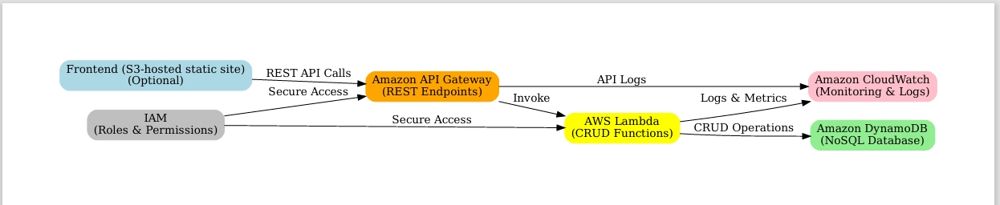

# AWS Serverless ToDo API

This project is a serverless ToDo application built with **AWS Lambda**, **API Gateway**, and **DynamoDB**.  
It provides a RESTful API for creating, reading, updating, and deleting tasks.

---

## Live API URL
Base URL: https://benz2wh7q6.execute-api.eu-north-1.amazonaws.com/dev/task

---

## 📌 Features
- `POST /task` → Create a new task  
- `GET /task` → Retrieve all tasks  
- `PATCH /task` → Update a task by ID  
- `DELETE /task` → Delete a task by ID  

---

## 🗂️ Project Architecture

---

## 🛠️ Tools & Technologies
- AWS Lambda (Node.txt)
- API Gateway
- DynamoDB
- GitHub

---

## Optional Deliverable
- Recorded demo or live Postman test *(optional)*

---

## 👩🏽‍💻 Author
Your Name – (https://github.com/Giftedsayrah)

